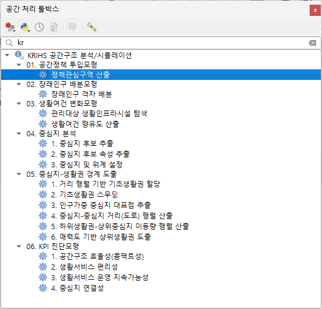

# KRIHS 공간구조 분석/시뮬레이션 도구 — 설명 대시보드

QGIS 공간구조 분석/시뮬레이션 도구(17개)를 한 화면에 하나씩 넘겨보는 설명 대시보드입니다.
도구별 **입력 → 처리(4단계) → 출력**, **중복·유사 기능**, **기능 결합(Airflow식 흐름도)**, **전체 폴더 구조 트리**를 제공합니다.

🔗 **[대시보드 보기](https://handbell-h.github.io/dashboard/simtool_dashboard/dashboard.html)**

## 도구 구성 (폴더 구조)

- 01. 공간정책 투입모형 · 02. 장래인구 배분모형 · 03. 생활여건 변화모형
- 04. 중심지 분석 · 05. 중심지-생활권 경계 도출
- 06. KPI 진단모형 (구현 예정)

## QGIS Processing 툴박스

